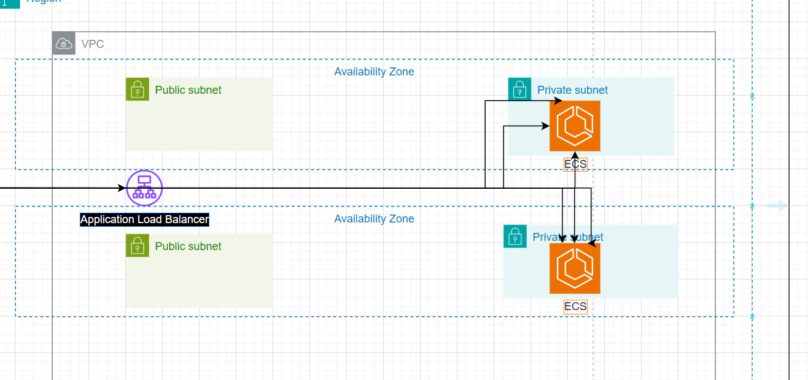

In this step, we will create a VPC with 2 public and private subnets. Then, create a Linux EC2 Instance located in the public subnet and a Windows EC2 Instance located in the private subnet.

The architecture overview after you complete this step will be as follows:

To learn how to create EC2 instances and VPCs with public/private subnets, you can refer to the lab:
  - [About Amazon EC2](https://000004.awsstudygroup.com/en/)
  - [Working with Amazon VPC](https://000003.awsstudygroup.com/en/)

### Content
  - [Create VPC](2.1.1-createvpc/)
  - [Create Public Subnet](2.1.2-createpublicsubnet/)
  - [Create Private Subnet](2.1.3-createprivatesubnet/)
  - [Create Security Group](2.1.4-createsecgroup/)
  - [Create Public Linux Server](2.1.5-createec2linux/)
  - [Create Private Windows Server](2.1.6-createec2windows/)
