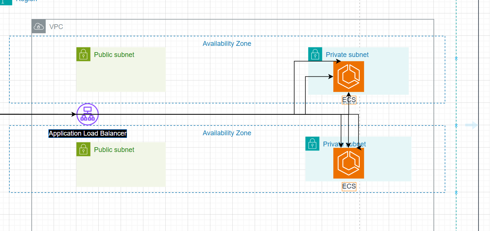

Trong bước này, chúng ta sẽ tạo một VPC với 2 subnet công khai và riêng tư. Sau đó, tạo một EC2 Instance Linux nằm trong subnet công khai và một EC2 Instance Windows nằm trong subnet riêng tư.

Kiến trúc tổng quan sau khi bạn hoàn thành bước này sẽ như sau:

Để tìm hiểu cách tạo các instance EC2 và VPC với subnet công khai/riêng tư, bạn có thể tham khảo bài lab:
  - [Giới thiệu về Amazon EC2](https://000004.awsstudygroup.com/vi/)
  - [Làm việc với Amazon VPC](https://000003.awsstudygroup.com/vi/)

### Nội dung
  - [Tạo VPC](2.1.1-createvpc/)
  - [Tạo Subnet công khai](2.1.2-createpublicsubnet/)
  - [Tạo Subnet riêng tư](2.1.3-createprivatesubnet/)
  - [Tạo nhóm bảo mật](2.1.4-createsecgroup/)
  - [Tạo máy chủ Linux công khai](2.1.5-createec2linux/)
  - [Tạo máy chủ Windows riêng tư](2.1.6-createec2windows/)
